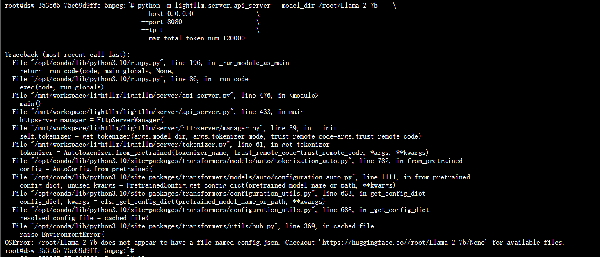

### 下载

```
git clone https://github.com/ModelTC/lightllm.git
cd lightllm
pip install -r requirements.txt
```

### 安装

```
python setup.py install
```

### 下载llama模型

```
git clone https://www.modelscope.cn/shakechen/Llama-2-7b.git
```

### 运行
```
python -m lightllm.server.api_server --model_dir /root/Llama-2-7b    \
                                     --host 0.0.0.0                 \
                                     --port 8080                    \
                                     --tp 1                         \
                                     --max_total_token_num 120000
```

### 报错


解决：
You should load model that converted to HF. such as "meta-llama/Llama-2-7b-chat-hf".


### 查看显存占用状态
```
watch -n 1 nvidia-smi
```

### 重新运行
```
python -m lightllm.server.api_server --model_dir /root/Llama-2-7b-hf    \
                                     --host 0.0.0.0                 \
                                     --port 8080                    \
                                     --tp 1                     
```

执行后再次报错：


使用Qwen-VL试试
```
git clone https://www.modelscope.cn/qwen/Qwen-VL.git

python -m lightllm.server.api_server --model_dir /root/Qwen-VL    \
                                     --host 0.0.0.0                 \
                                     --port 8080                    \
                                     --tp 1   --trust_remote_code 
```

### 测试
```
curl http://127.0.0.1:8080/generate     \
    -X POST                             \
    -d '{"inputs":"What is AI?","parameters":{"max_new_tokens":17, "frequency_penalty":1}}' \
    -H 'Content-Type: application/json'
```

### To query from Python
```
import time
import requests
import json

url = 'http://localhost:8080/generate'
headers = {'Content-Type': 'application/json'}
data = {
    'inputs': 'What is AI?',
    "parameters": {
        'do_sample': False,
        'ignore_eos': False,
        'max_new_tokens': 1024,
    }
}
response = requests.post(url, headers=headers, data=json.dumps(data))
if response.status_code == 200:
    print(response.json())
else:
    print('Error:', response.status_code, response.text)
```