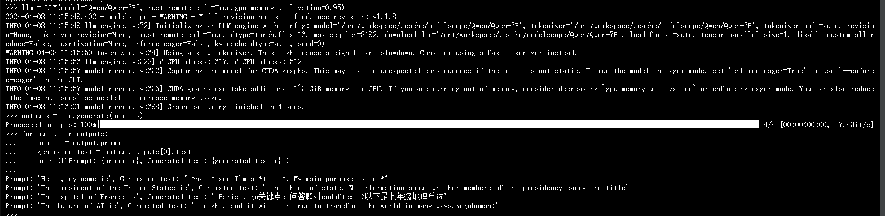
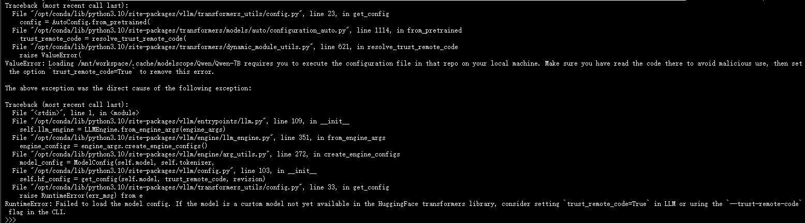
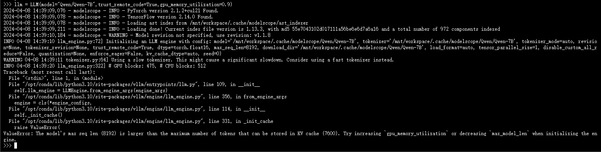

### 大模型推理工具：vLLM的入门使用

#### 简介
vLLM是一个快速且易于使用的LLM推理和服务库。

vLLM速度很快：

- 最先进的服务吞吐量
- 使用PagedNote有效管理注意力键和值内存
- 传入请求的连续批处理
- 使用CUDA/HIP图快速执行模型
- 量化：GPTQ、AWQ、SqueezeLLM、FP8 KV缓存
- 优化的CUDA内核

vLLM灵活且易于使用：

- 与流行的拥抱脸模型无缝集成
- 高吞吐量服务于各种解码算法，包括并行采样、波束搜索等
- 分布式推理的张量并行性支持
- 流式输出
- 与OpenAI兼容的API服务器
- 支持NVIDIA GPU和AMD GPU
- （实验性）前缀缓存支持
- （实验性）Multi-lora支持

vLLM无缝支持多种拥抱脸模型，包括以下架构：

- Aquila & Aquila2 (BAAI/AquilaChat2-7B, BAAI/AquilaChat2-34B, BAAI/Aquila-7B, BAAI/AquilaChat-7B, etc.)
- Baichuan & Baichuan2 (baichuan-inc/Baichuan2-13B-Chat, baichuan-inc/Baichuan-7B, etc.)
- BLOOM (bigscience/bloom, bigscience/bloomz, etc.)
- ChatGLM (THUDM/chatglm2-6b, THUDM/chatglm3-6b, etc.)
- Command-R (CohereForAI/c4ai-command-r-v01, etc.)
- DBRX (databricks/dbrx-base, databricks/dbrx-instruct etc.)
- DeciLM (Deci/DeciLM-7B, Deci/DeciLM-7B-instruct, etc.)
- Falcon (tiiuae/falcon-7b, tiiuae/falcon-40b, tiiuae/falcon-rw-7b, etc.)
- Gemma (google/gemma-2b, google/gemma-7b, etc.)
- GPT-2 (gpt2, gpt2-xl, etc.)
- GPT BigCode (bigcode/starcoder, bigcode/gpt_bigcode-santacoder, etc.)
- GPT-J (EleutherAI/gpt-j-6b, nomic-ai/gpt4all-j, etc.)
- GPT-NeoX (EleutherAI/gpt-neox-20b, databricks/dolly-v2-12b, stabilityai/stablelm-tuned-alpha-7b, etc.)
- InternLM (internlm/internlm-7b, internlm/internlm-chat-7b, etc.)
- InternLM2 (internlm/internlm2-7b, internlm/internlm2-chat-7b, etc.)
- Jais (core42/jais-13b, core42/jais-13b-chat, core42/jais-30b-v3, core42/jais-30b-chat-v3, etc.)
- LLaMA & LLaMA-2 (meta-llama/Llama-2-70b-hf, lmsys/vicuna-13b-v1.3, young-geng/koala, openlm-research/open_llama_13b, etc.)
- Mistral (mistralai/Mistral-7B-v0.1, mistralai/Mistral-7B-Instruct-v0.1, etc.)
- Mixtral (mistralai/Mixtral-8x7B-v0.1, mistralai/Mixtral-8x7B-Instruct-v0.1, etc.)
- MPT (mosaicml/mpt-7b, mosaicml/mpt-30b, etc.)
- OLMo (allenai/OLMo-1B, allenai/OLMo-7B, etc.)
- OPT (facebook/opt-66b, facebook/opt-iml-max-30b, etc.)
- Orion (OrionStarAI/Orion-14B-Base, OrionStarAI/Orion-14B-Chat, etc.)
- Phi (microsoft/phi-1_5, microsoft/phi-2, etc.)
- Qwen (Qwen/Qwen-7B, Qwen/Qwen-7B-Chat, etc.)
- Qwen2 (Qwen/Qwen1.5-7B, Qwen/Qwen1.5-7B-Chat, etc.)
- Qwen2MoE (Qwen/Qwen1.5-MoE-A2.7B, Qwen/Qwen1.5-MoE-A2.7B-Chat, etc.)
- StableLM(stabilityai/stablelm-3b-4e1t, stabilityai/stablelm-base-alpha-7b-v2, etc.)
- Starcoder2(bigcode/starcoder2-3b, bigcode/starcoder2-7b, bigcode/starcoder2-15b, etc.)
- Xverse (xverse/XVERSE-7B-Chat, xverse/XVERSE-13B-Chat, xverse/XVERSE-65B-Chat, etc.)
- Yi (01-ai/Yi-6B, 01-ai/Yi-34B, etc.)

#### 依赖
- OS: Linux
- Python: 3.8 – 3.11
- GPU: compute capability 7.0 or higher (e.g., V100, T4, RTX20xx, A100, L4, H100, etc.)

#### 安装
```
# (Recommended) Create a new conda environment.
conda create -n myenv python=3.9 -y
conda activate myenv

# Install vLLM with CUDA 12.1.
pip install vllm==0.4.0
```

#### 注意
默认情况下，vLLM从HuggingFace下载模型。如果您想在以下示例中使用ModelScope中的模型，请设置环境变量：
```
echo 'export VLLM_USE_MODELSCOPE=True' >> ~/.bashrc
source ~/.bashrc
```

#### 快速开始
```
from vllm import LLM
prompts = [
    "Hello, my name is",
    "The president of the United States is",
    "The capital of France is",
    "The future of AI is",
]

llm = LLM(model="Qwen/Qwen-7B",trust_remote_code=True,gpu_memory_utilization=0.9) 

outputs = llm.generate(prompts)
for output in outputs:
    prompt = output.prompt
    generated_text = output.outputs[0].text
    print(f"Prompt: {prompt!r}, Generated text: {generated_text!r}")
```



#### OpenAI-兼容服务器
vLLM可以部署为实现OpenAI API协议的服务器。这允许vLLM用作使用OpenAI API的应用程序的直接替代品。 默认情况下，它在http://localhost:8000启动服务器。您可以使用--host和--port参数指定地址。

启动服务器
```
python -m vllm.entrypoints.openai.api_server --trust-remote-code --model Qwen/Qwen-7B
```

默认情况下，服务器使用存储在令牌器中的预定义聊天模板。您可以使用--chat-template参数覆盖此模板：

```
python -m vllm.entrypoints.openai.api_server \
--model Qwen/Qwen-7B \
--chat-template ./examples/template_chatml.jinja
```

该服务器可以以与OpenAI API相同的格式查询。例如，列出模型：

```
curl http://localhost:8000/v1/models
```

#### 在线服务调用
```
curl http://localhost:8000/v1/completions \
-H "Content-Type: application/json" \
-d '{
"model": "Qwen/Qwen-7B",
"prompt": "San Francisco is a",
"max_tokens": 7,
"temperature": 0
}'
```

-d 里面是请求的参数，可以自己设置。temperature 为 0，代表每次模型的回答都相同，不具有随机性，你可以自由调整参数来满足你的需求

#### 常见问题
您可能会遇到的OOM（内存溢出）问题。可以尝试将这两个参数进行修复。第一个参数是 --max-model-len 。我们提供的默认最大位置嵌入（max_position_embedding）为32768，因此服务时的最大长度也是这个值，这会导致更高的内存需求。将此值适当减小通常有助于解决OOM问题。另一个您可以关注的参数是 --gpu-memory-utilization 。默认情况下，该值为 0.9 ，你可以将其调高以应对OOM问题。这也是为什么您发现一个大型语言模型服务总是占用大量内存的原因。

#### 错误处理
##### RuntimeError
RuntimeError: Failed to load the model config. If the model is a custom model not yet available in the HuggingFace transformers library, consider setting `trust_remote_code=True` in LLM or using the `--trust-remote-code` flag in the CLI.



启动llm时，指定trust_remote_code=True
```
llm = LLM(model="Qwen/Qwen-7B",trust_remote_code=True) 
```

##### ValueError
ValueError: The model's max seq len (8192) is larger than the maximum number of tokens that can be stored in KV cache (7600). Try increasing `gpu_memory_utilization` or decreasing `max_model_len` when initializing the engine.



启动llm时，指定gpu_memory_utilization=0.9
```
llm = LLM(model="Qwen/Qwen-7B",gpu_memory_utilization=0.9)
```

#### 参考地址

[https://docs.vllm.ai/en/latest/getting_started/quickstart.html](https://docs.vllm.ai/en/latest/getting_started/quickstart.html)

[https://qwen.readthedocs.io/zh-cn/latest/deployment/vllm.html](https://qwen.readthedocs.io/zh-cn/latest/deployment/vllm.html)
