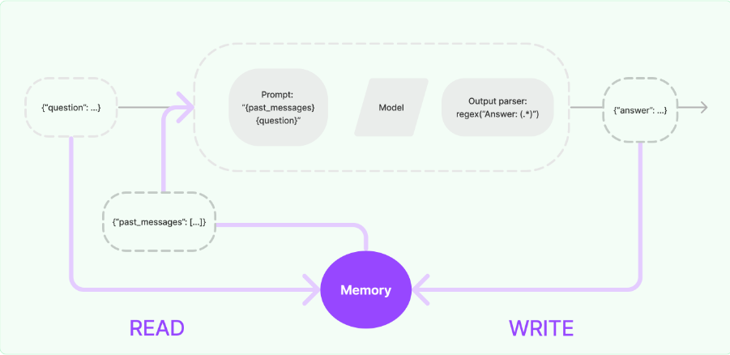

### 介绍
内存系统需要支持两个基本动作：读取和写入。回想一下，每个链都定义了一些需要某些输入的核心执行逻辑。其中一些输入直接来自用户，但其中一些输入可能来自内存。在给定的运行中，一条链将与其内存系统交互两次。

在接收到初始用户输入后但在执行核心逻辑之前，链将从其内存系统中读取并增强用户输入。
在执行核心逻辑之后但在返回答案之前，链将把当前运行的输入和输出写入内存，以便在未来运行中引用它们。


任何内存系统中的两个核心设计决策是：

- 状态是如何存储的
- 如何查询状态

#### 存储：聊天消息列表
任何内存的基础都是所有聊天交互的历史记录。即使这些不是全部直接使用，它们也需要以某种形式存储。LangChain内存模块的关键部分之一是用于存储这些聊天消息的一系列集成，从内存列表到持久数据库

#### 查询：聊天消息之上的数据结构和算法
保留聊天消息列表相当简单。不太直接的是建立在聊天消息之上的数据结构和算法，这些数据结构和算法服务于最有用的消息视图。

一个非常简单的内存系统可能只返回每次运行的最新消息。稍微复杂一点的内存系统可能会返回过去K条消息的简洁摘要。一个更复杂的系统可能会从存储的消息中提取实体，并且只返回当前运行中引用的实体的信息。

每个应用程序对内存的查询方式可能有不同的要求。内存模块应该可以轻松地开始使用简单的内存系统，并在需要时编写自己的自定义系统

#### 实现
LangChain内存模块的核心是`ConversationBufferMemory`类。它是一个简单的内存系统，它将聊天消息存储在列表中，并允许您查询这些消息。
    
```
from langchain.prompts import PromptTemplate
from langchain_core.prompts import PromptTemplate
from langchain.chains import LLMChain
from langchain.memory import ConversationBufferMemory

from langchain_community.llms import Ollama
llm = Ollama(model="qwen:7b")

# Notice that "chat_history" is present in the prompt template
template = """You are a nice chatbot having a conversation with a human.

Previous conversation:
{chat_history}

New human question: {question}
Response:"""
prompt = PromptTemplate.from_template(template)
# Notice that we need to align the `memory_key`
memory = ConversationBufferMemory(memory_key="chat_history")
conversation = LLMChain(
    llm=llm,
    prompt=prompt,
    verbose=True,
    memory=memory
)
conversation({"question": "hi"})
```

输出

```
{'question': 'hi',
 'chat_history': '',
 'text': 'Hello there! How may I assist you today?\n'}
```

再次提问，查看聊天历史
```
conversation({"question": "who aer you"})
```

输出
```
{'question': 'who aer you',
 'chat_history': 'Human: hi\nAI: Hello there! How may I assist you today?\n',
 'text': "I am an AI chatbot designed to have conversations with humans. I don't have a physical existence, but I'm here to provide information and assistance when needed. Is there anything specific you'd like to know or discuss?\n"}
```
