## 基于chatOllama100%实现本地RAG应用

### 环境
- Windows 10
- Docker
- ollama

### 基于Docker环境安装chatOllama
#### 下载chatOllama
下载到桌面[docker-compose.yaml](https://github.com/sugarforever/chat-ollama/blob/main/docker-compose.yaml)，并在命令行中执行如下命令，开始下载相关docker
```
cd C:\Users\Administrator\Desktop
docker compose up
```
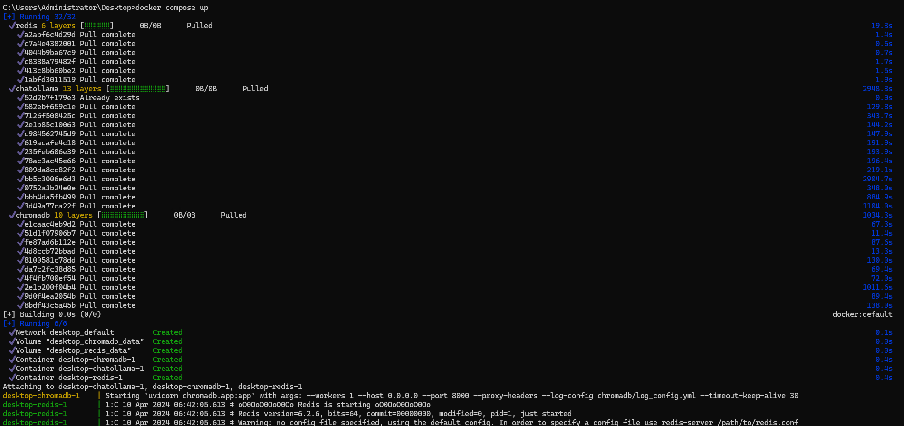

下载完成后会看到Docker Desktop中有三个容器在运行
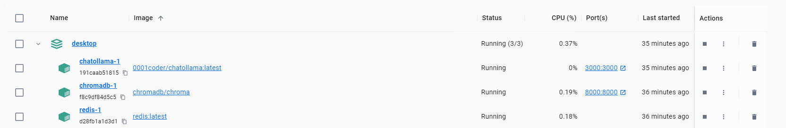


#### 配置环境变量
##### Windows配置
由于chatOllama是运行是docker容器中，所以需要在本机设置环境变量，将chatOllama的地址设置为环境变量，方便后续调用
```
OLLAMA_HOST=http://host.docker.internal:11434
```
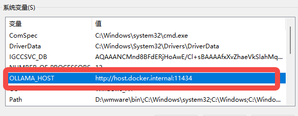

##### Linux配置
修改/etc/systemd/system/ollama.service后重新加载

```
[Unit]
Description=Ollama Service
After=network-online.target

[Service]
ExecStart=/usr/local/bin/ollama serve
User=ollama
Group=ollama
Restart=always
RestartSec=3
Environment="PATH=/home/terry/anaconda3/bin:/home/terry/anaconda3/condabin:/usr/local/sbin:/usr/local/bin:/usr/sbin:/usr/bin:/sbin:/bin:/usr/games:/usr/local/games:/snap/bin"
Environment="OLLAMA_HOST=0.0.0.0:11434"

[Install]
WantedBy=default.target
```
重新加载配置
```
sudo systemctl daemon-reload
sudo systemctl restart ollama
netstat -an|grep 11434 #看到监听地址为：0.0.0.0:11434即可
```

#### 初始化SQLite数据库
```
docker compose exec chatollama npx prisma migrate dev
```
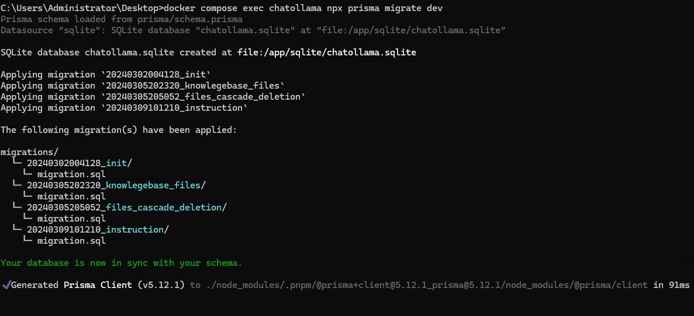

#### 下载文本嵌入模型
```
ollama pull nomic-embed-text:latest
```
### 访问chatOllama
访问地址：http://l27.0.0.1:3000/

看到如下页面说明chatollama已经成功运行

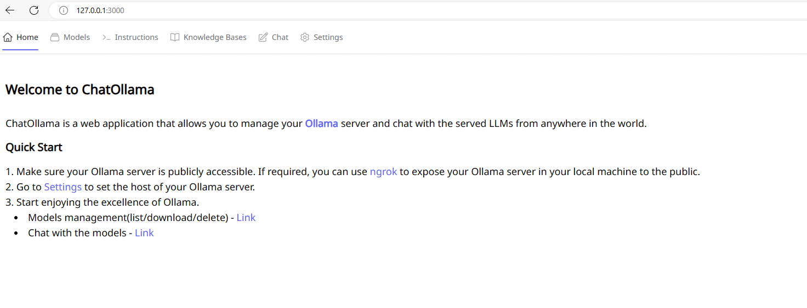

#### 配置chatOllama
进入设置页面，配置ollama server，地址配置为：
http://host.docker.internal:11434
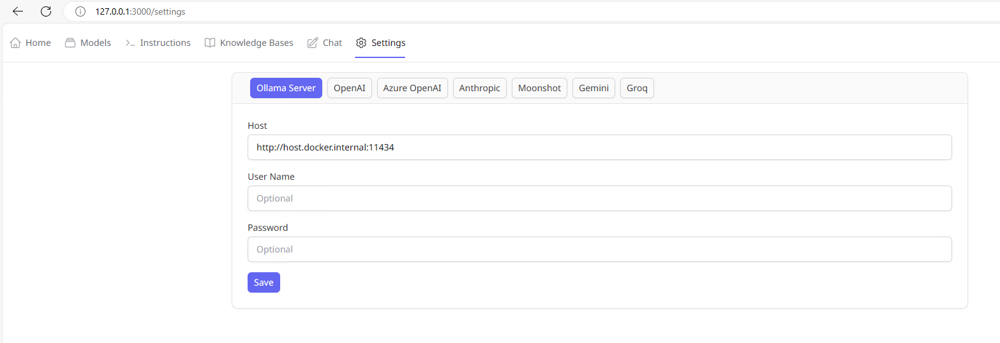
#### 模型下载
进入模型下载页面，下载模型，因为我之前用ollama pull过很多模型，所以这里就展示出来了，如果没有下载过，在下载地址栏输入模型名称即可

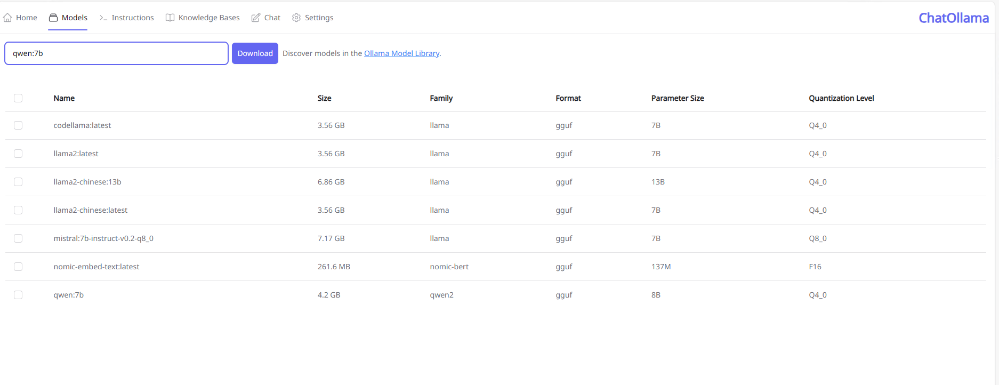

### 本地知识库
#### 导入本地文件
进入知识库页面，点击导入本地文件，选择本地文件，点击导入即可，支持多个文件导入
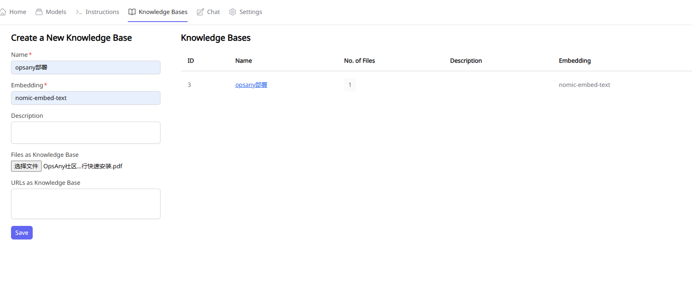

本地文件内容：
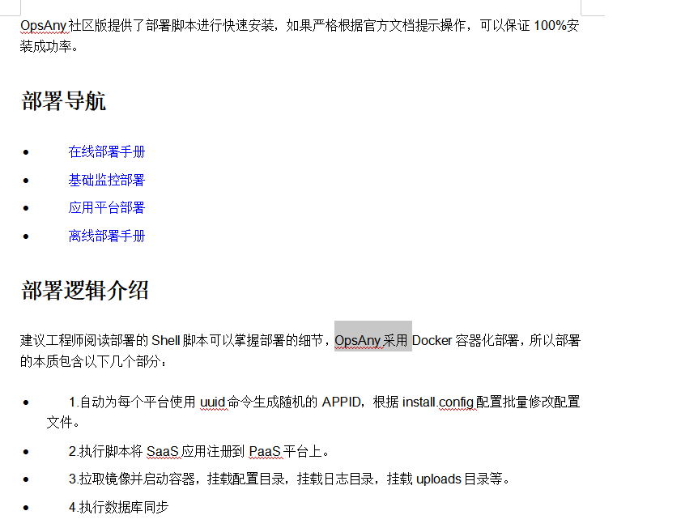

#### 配置chat
导入完成之后，点击opsany部署，进入chat页面，点击编辑按钮就入编辑页面，选择模型
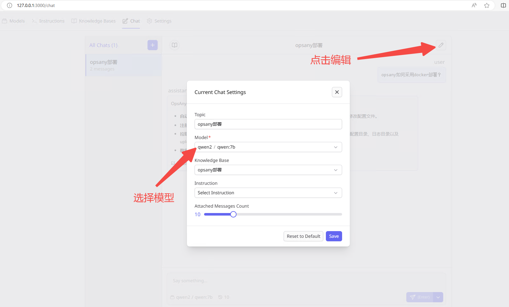

#### 开始问答
根据文档内容提问，可以得到相应的回答，可以看到回答的内容和上传的文档内容大致相似，并且可以看到来源是pdf文档
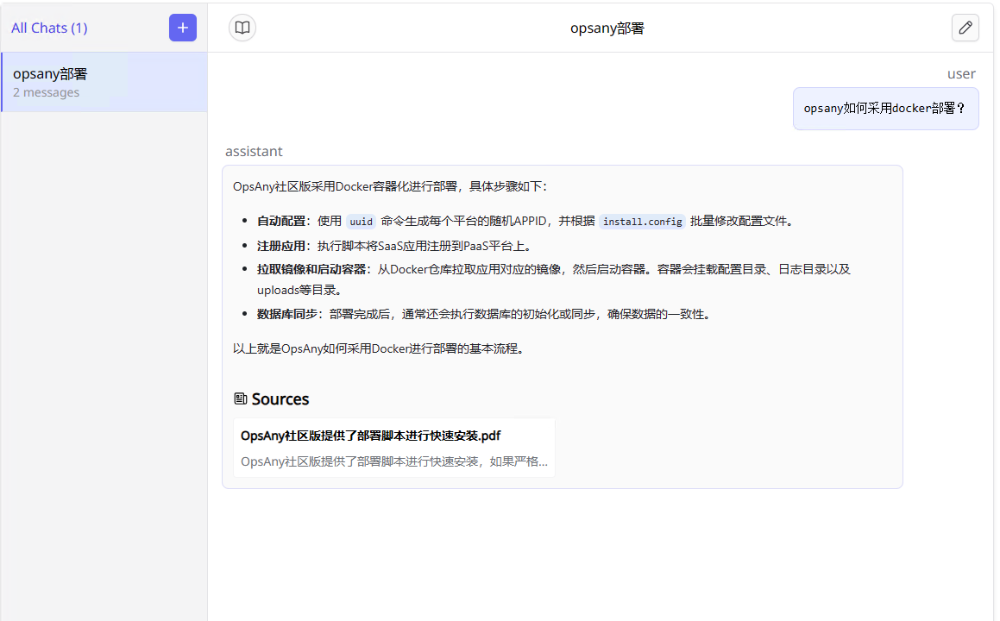

#### 以下是没有使用本地知识库的情况
可以看到回答和上传的问答是明显不一样的
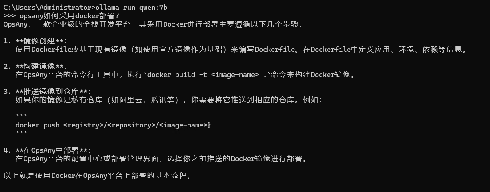