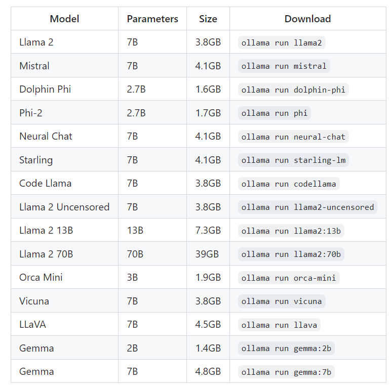
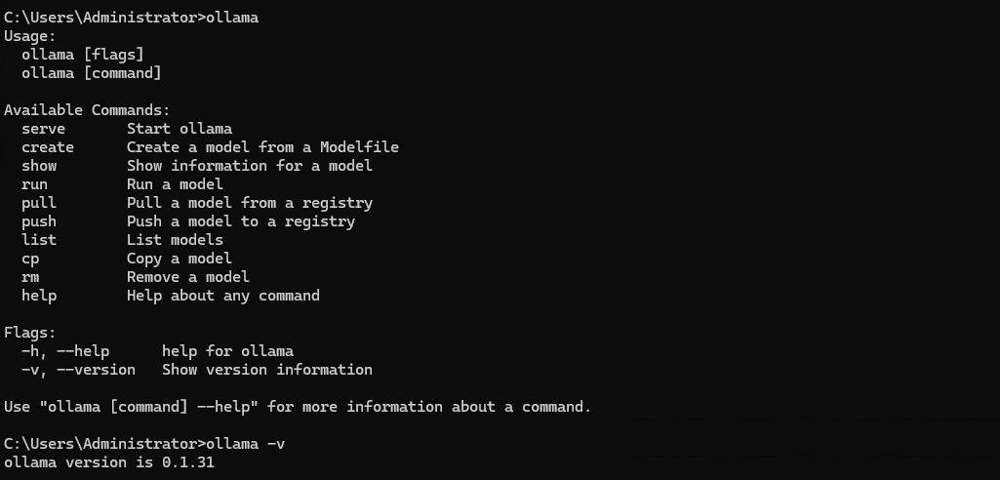
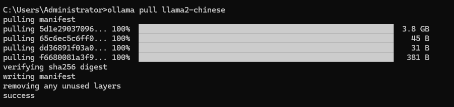
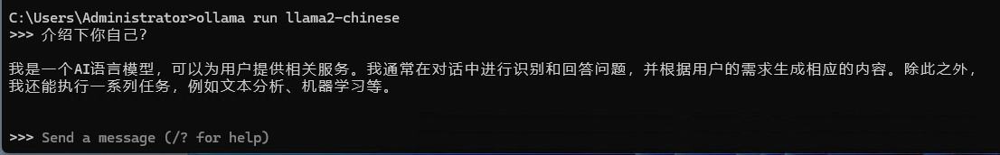
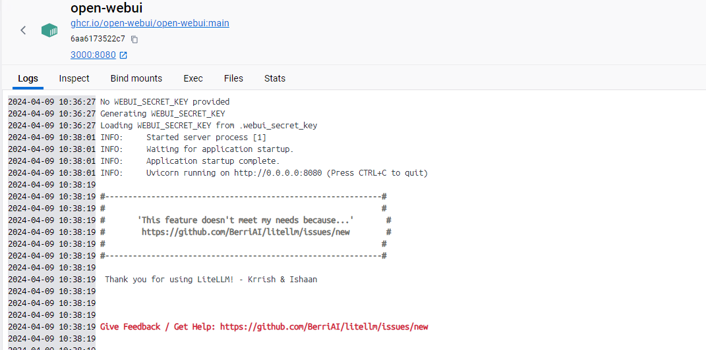
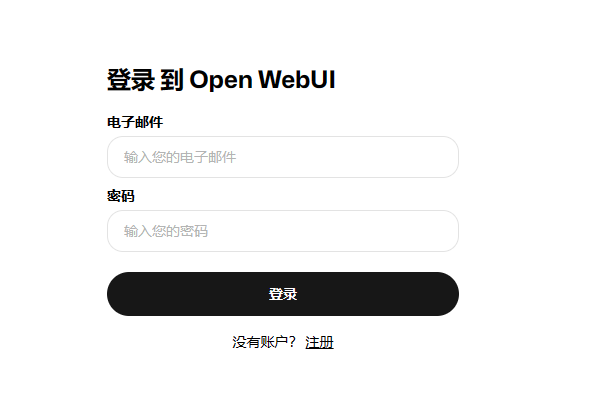
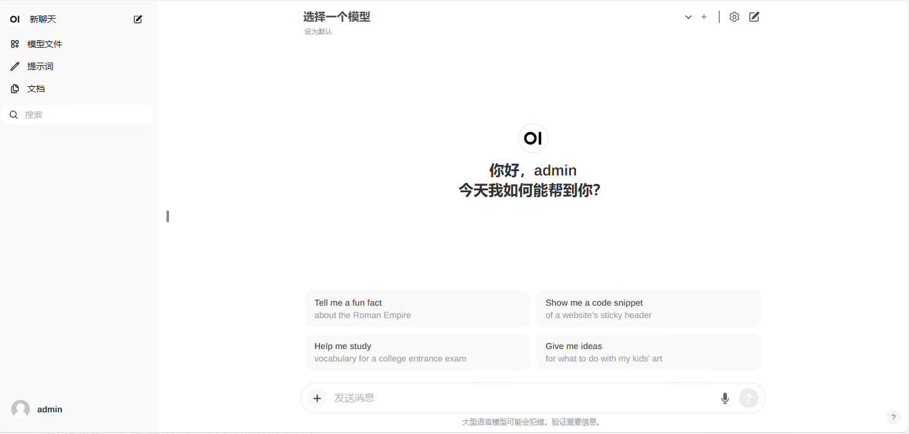
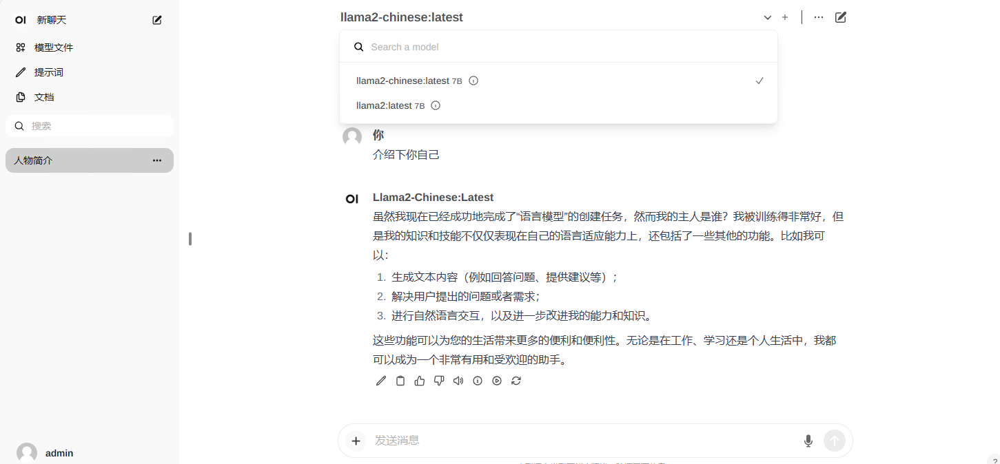

### 轻松搭建本地大模型Ollama+OpenWebUI

#### 介绍
Ollama是一个开源的LLaMA 2.0的桌面应用程序，它允许用户在本地运行LLaMA 2.0，并使用它进行聊天、生成文本等操作。

#### 支持模型库


#### Ollama搭建
本次搭建环境为windows环境，所以官网直接下载ollama.exe，并安装即可，安装后打开cmd，输入ollama，即可看到ollama的版本信息，说明安装成功。



下载llama2-chinese模型
```
ollama pull llama2-chinese
```


运行ollama
```
ollama run llama2-chinese
```


这样就成功搭建好了ollama，接下来就是搭建OpenWebUI

#### OpenWebUI搭建
OpenWebUI是一个开源的Web界面，它允许用户通过浏览器来访问和控制Ollama。

最快速访问open webui的方式就是用docker的方式进行访问，如果本地没有docker环境，建议安装个docker环境。

安装完docker环境后，在cmd中输入以下命令，即可运行open webui
```
docker run -d -p 3000:8080 --add-host=host.docker.internal:host-gateway -v open-webui:/app/backend/data --name open-webui --restart always ghcr.io/open-webui/open-webui:main
```

启动可能需要时间，见到如下内容后说明启动成功



启动成功后，在浏览器中输入http://localhost:3000即可访问open webui



第一次登录需要注册个用户，注册完后即可看到open webui的界面



选择模型后，会出现你之前通过ollama pull下载的模型，选择一个模型开始你的大模型之旅吧




