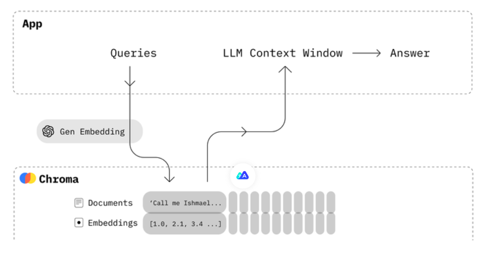
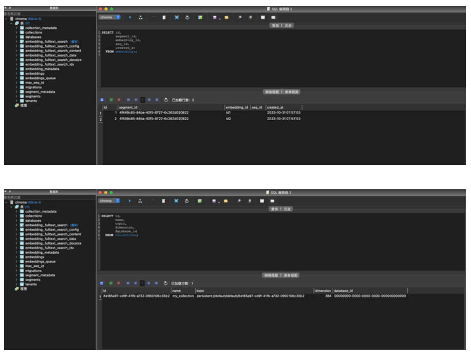
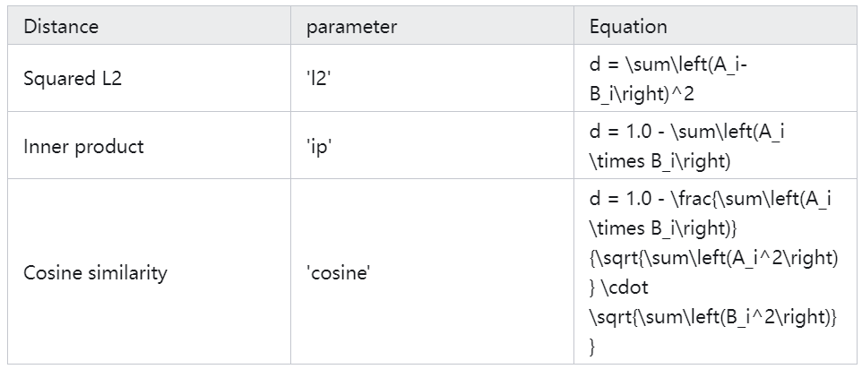

### Chroma快速上手
#### 设计理念
Chroma的目标是帮助用户更加便捷地构建大模型应用，更加轻松的将知识（knowledge）、事实（facts）和技能（skills）等我们现实世界中的文档整合进大模型中。

Chroma提供的工具：

- 存储文档数据和它们的元数据：store embeddings and their metadata
- 嵌入：embed documents and queries
- 搜索： search embeddings

Chroma的设计优先考虑：

- 足够简单并且提升开发者效率：simplicity and developer productivity
- 搜索之上再分析：analysis on top of search
- 追求快（性能）： it also happens to be very quick



目前官方提供了Python和JavaScript版本，也有其他语言的社区版本支持。

#### 本地部署与启动
```
pip install chromadb
chroma run 
--path TEXT The path to the file or directory. [default: ./chroma_data]                                   
--host TEXT The host to listen to. Default: localhost [default:localhost]                                 
--log-path TEXT The path to the log file. [default: chroma.log]                                
--port INTEGER The port to run the server on. [default: 8000]                                 
--help Show this message and exit.
```

#### 完整Demo
首先需要Python环境（Chroma官方原生支持Python和JavaScript，本文用Python做示例）
```
pip install chromadb
```
直接运行如下代码，便是一个完整的Demo：
```
import chromadb
chroma_client = chromadb.Client()

collection = chroma_client.create_collection(name="my_collection")

collection.add(
    documents=["This is a document about engineer", "This is a document about steak"],
    metadatas=[{"source": "doc1"}, {"source": "doc2"}],
    ids=["id1", "id2"]
)

results = collection.query(
    query_texts=["Which food is the best?"],
    n_results=2
)

print(results)
```
上面的代码中，我们向Chroma提交了两个文档（简单起见，是两个字符串），一个是This is a document about engineer，一个是This is a document about steak。若在add方法没有传入embedding参数，则会使用Chroma默认的all-MiniLM-L6-v2 方式进行embedding。随后，我们对数据集进行query，要求返回两个最相关的结果。提问内容为：Which food is the best?

返回结果：
```
{
 'ids': [
  ['id2', 'id1']
 ],
 'distances': [
  [1.5835548639297485, 2.1740970611572266]
 ],
 'metadatas': [
  [{
   'source': 'doc2'
  }, {
   'source': 'doc1'
  }]
 ],
 'embeddings': None,
 'documents': [
  ['This is a document about steak', 'This is a document about engineer']
 ]
}
```
结果显示，两个文档都被正确返回，且id2由于是steak（牛排），相关性与我们的提问更大，排在了首位。还打印了distances。

简单，易理解。

#### 数据持久化
Chroma一般是直接作为内存数据库使用，但是也可以进行持久化存储。

在初始化Chroma Client时，使用PersistentClient：
```
client = chromadb.PersistentClient(path="/Users/yourname/xxxx")
```
这样在运行代码后，在你指定的位置会新建一个chroma.sqlite3文件。

这个sqlite3的数据库里包含的表如下图，从中可以窥见一部分Chroma的数据存储思路：



Chroma Client还支持下面两个API：
```
client.heartbeat() # returns a nanosecond heartbeat. Useful for making sure the client remains connected.
client.reset() # Empties and completely resets the database. ⚠️ This is destructive and not reversible.
```
此外，Chroma还支持服务端，客户端模式，用于跨进程通信。详见：

https://docs.trychroma.com/usage-guide#running-chroma-in-clientserver-mode

#### 数据集（Collection）
collection是Chroma中一个重要的概念，下面的代码和注释简单介绍了collection的主要功能和使用方法。
```
collection = client.get_collection(name="test") # Get a collection object from an existing collection, by name. Will raise an exception if it's not found.
collection = client.get_or_create_collection(name="test") # Get a collection object from an existing collection, by name. If it doesn't exist, create it.
client.delete_collection(name="my_collection") # Delete a collection and all associated embeddings, documents, and metadata. ⚠️ This is destructive and not reversible
collection.peek() # returns a list of the first 10 items in the collection
collection.count() # returns the number of items in the collection
collection.modify(name="new_name") # Rename the collection
```
collection支持传入一些自身的元数据metadata：
```
collection = client.create_collection(
    name="collection_name",
    metadata={"hnsw:space": "cosine"} # l2 is the default
)
```
collection允许用户自行切换距离计算函数，方法是通过设置cellection的metadata中的“hnsw:space”：
```
collection = client.create_collection(
      name="collection_name",
      metadata={"hnsw:space": "cosine"} # l2 is the default
  )
```

#### 文档（Document）
在上面的Demo中，我们使用了默认的add函数。
```
def add(ids: OneOrMany[ID],
        embeddings: Optional[OneOrMany[Embedding]] = None,
        metadatas: Optional[OneOrMany[Metadata]] = None,
        documents: Optional[OneOrMany[Document]] = None) -> None
```
除此之外，你还可以有如下传参：

- ids: 文档的唯一ID
- embeddings（可选）: 如果不传该参数，将根据Collection设置的embedding_function进行计算。
- metadatas（可选）：要与嵌入关联的元数据。在查询时，您可以根据这些元数据进行过滤。
- documents（可选）：与该嵌入相关联的文档，甚至可以不放文档。
示例：
```
collection.add(
    embeddings=[[1.2, 2.3, 4.5], [6.7, 8.2, 9.2]],
    documents=["This is a document", "This is another document"],
    metadatas=[{"source": "my_source"}, {"source": "my_source"}],
    ids=["id1", "id2"]
)
```
#### 简单查询
输入文档内的文本进行相似性查询，可以使用query方法
```
collection.query(
    query_embeddings=[[11.1, 12.1, 13.1],[1.1, 2.3, 3.2], ...],
    n_results=10,
    where={"metadata_field": "is_equal_to_this"},
    where_document={"$contains":"search_string"}
)
```
若想要通过id查找，可以使用get方法
```
collection.get(
    ids=["id1", "id2", "id3", ...],
    where={"style": "style1"}
)
```
与此同时，你可以定制返回结果包含的数据
```
# Only get documents and ids
collection.get({
    include: [ "documents" ]
})

collection.query({
    queryEmbeddings: [[11.1, 12.1, 13.1],[1.1, 2.3, 3.2], ...],
    include: [ "documents" ]
})
```
#### 条件查询
Chroma 支持按元数据和文档内容过滤查询。

where 字段用于按元数据进行过滤
```
{
    "metadata_field": {
        <Operator>: <Value>
    }
}
```
支持下列操作操作符：
```
$eq - equal to (string, int, float)
$ne - not equal to (string, int, float)
$gt - greater than (int, float)
$gte - greater than or equal to (int, float)
$lt - less than (int, float)
$lte - less than or equal to (int, float)
# is equivalent to
{
    "metadata_field": {
        "$eq": "search_string"
    }
}
```
where_document 字段用于按文档内容进行过滤
```
# Filtering for a search_string
{
    "$contains": "search_string"
}
```
#### 使用逻辑运算符

可以在查询条件中使用逻辑运算符
```
{
    "$and": [
        {
            "metadata_field": {
                <Operator>: <Value>
            }
        },
        {
            "metadata_field": {
                <Operator>: <Value>
            }
        }
    ]
}

{
    "$or": [
        {
            "metadata_field": {
                <Operator>: <Value>
            }
        },
        {
            "metadata_field": {
                <Operator>: <Value>
            }
        }
    ]
}
```
#### 使用in/not in

in将返回metadata中包含给出列表中属性值的文档：
```
{
  "metadata_field": {
    "$in": ["value1", "value2", "value3"]
  }
}
```
not in则与其相反：
```
{
  "metadata_field": {
    "$nin": ["value1", "value2", "value3"]
  }
}
```
#### 更新文档
带上ids，其他参数和add方法类似
```
collection.update(
    ids=["id1", "id2", "id3", ...],
    embeddings=[[1.1, 2.3, 3.2], [4.5, 6.9, 4.4], [1.1, 2.3, 3.2], ...],
    metadatas=[{"chapter": "3", "verse": "16"}, {"chapter": "3", "verse": "5"}, {"chapter": "29", "verse": "11"}, ...],
    documents=["doc1", "doc2", "doc3", ...],
)
```
#### 删除文档
提供ids，还允许附带where条件进行删除
```
collection.delete(
    ids=["id1", "id2", "id3",...],
    where={"chapter": "20"}
)
```
### Chroma Embeddings算法
#### 默认Embeddings算法
Chroma默认使用的是all-MiniLM-L6-v2模型来进行embeddings

#### 官方预训练模型
你也可以直接使用官方预训练的托管在Huggingface上的模型
```
from sentence_transformers import SentenceTransformer
model = SentenceTransformer('model_name')
The all-* models where trained on all available training data (more than 1 billion training pairs) and are designed as general purpose models. The all-mpnet-base-v2 model provides the best quality, while all-MiniLM-L6-v2 is 5 times faster and still offers good quality. Toggle All models to see all evaluated models or visit HuggingFace Model Hub to view all existing sentence-transformers models.
```
选择非常多，你可以点击官网查看每种预训练模型的详细信息。

https://www.sbert.net/docs/pretrained_models.html


#### 其他第三方Embeddings算法
你还可以使用其他第三方模型，包括第三方平台，例如：
```
openai_ef = embedding_functions.OpenAIEmbeddingFunction(
                api_key="YOUR_API_KEY",
                model_name="text-embedding-ada-002"
            )
```
其他包括Cohere，HuggingFace等。

#### 自定义Embeddings算法
你甚至可以使用自己的本地Embeddings算法，Chroma留有扩展点：
```
from chromadb import Documents, EmbeddingFunction, Embeddings

class MyEmbeddingFunction(EmbeddingFunction):
    def __call__(self, texts: Documents) -> Embeddings:
        # embed the documents somehow
        return embeddings
```
#### 实战：在Langchain中使用Chroma对中国古典四大名著进行相似性查询
很多人认识Chroma是由于Langchain经常将其作为向量数据库使用。不过Langchain官方文档里的Chroma示例使用的是英文Embeddings算法以及英文的文档语料。官方文档链接如下：

https://python.langchain.com/docs/modules/data_connection/vectorstores.html?highlight=chroma

既然我们是华语区博客，这本篇文章中，我们就尝试用中文的语料和Embeddings算法来做一次实战。

先贴上完整代码，我们再来逐步解释：
```
from langchain.document_loaders import TextLoader
from langchain.embeddings import ModelScopeEmbeddings
from langchain.text_splitter import CharacterTextSplitter
from langchain.vectorstores import Chroma
import chardet

# 读取原始文档
raw_documents_sanguo = TextLoader('/Users/rude3knife/Desktop/三国演义.txt', encoding='utf-16').load()
raw_documents_xiyou = TextLoader('/Users/rude3knife/Desktop/西游记.txt', encoding='utf-16').load()

# 分割文档
text_splitter = CharacterTextSplitter(chunk_size=500, chunk_overlap=0)
documents_sanguo = text_splitter.split_documents(raw_documents_sanguo)
documents_xiyou = text_splitter.split_documents(raw_documents_xiyou)
documents = documents_sanguo + documents_xiyou
print("documents nums:", documents.__len__())


# 生成向量（embedding）
model_id = "damo/nlp_corom_sentence-embedding_chinese-base"
embeddings = ModelScopeEmbeddings(model_id=model_id)
db = Chroma.from_documents(documents, embedding=embeddings)

# 检索
query = "美猴王是谁？"
docs = db.similarity_search(query, k=5)

# 打印结果
for doc in docs:
    print("===")
    print("metadata:", doc.metadata)
    print("page_content:", doc.page_content)
```
#### 准备原始文档
我下载了三国演义和西游记的全文本txt，作为我们的知识库，两个文本都在1.5MB左右。

在这里还遇到一个小插曲，本以为下载下来的文本时UTF-8编码，代码写成了encoding='utf-8'，结果TextLoader怎么读取都报编码错误，用眼睛也没法一下子判断是什么编码，问了GPT，可以用Python的chardet编码库判断。如果你也遇到同样的问题，可以也尝试用该方法获取编码。
```
import chardet

def detect_file_encoding(file_path):
    with open(file_path, 'rb') as f:
        result = chardet.detect(f.read())
    return result['encoding']

file_path = '/Users/rude3knife/Desktop/三国演义.txt'
encoding = detect_file_encoding(file_path)
print(f'The encoding of file {file_path} is {encoding}')

# 输出
The encoding of file /Users/yangzhendong/Desktop/三国演义.txt is UTF-16
```
#### 分隔文档
通常来说文档都是很大的，比如名著小说，法律文档，我们通过langchain提供的CharacterTextSplitter来帮我们分割文本：
```
text_splitter = CharacterTextSplitter(chunk_size=500, chunk_overlap=0)
```
####embedding
我们选择魔搭平台ModelScope里的通用中文embeddings算法（damo/nlp_corom_sentence-embedding_chinese-base）来作为我们的embedding算法。他有768维的向量。


为啥要选择魔搭而不选择Huggingface，因为...在代码里跑Langchain，连魔搭平台比较快，连不上Huggingface的原因你懂得。而且魔搭毕竟是达摩院的，自家人平台的还得支持一下。

#### query
将两个文档准备好后，我们进行提问，“美猴王是谁？” 要求返回5个相似答案。下面的返回的答案，可以看到，5个文档都是取自西游记.txt中的文本。
```
==========
metadata: {'source': '/Users/yangzhendong/Desktop/西游记.txt'}
page_content: 美猴王一见，倒身下拜，磕头不计其数，口中只道：“师父，师父！我弟子志心朝礼，志心朝礼！”祖师道：“你是那方人氏？且说个乡贯姓名明白，再拜。”猴王道：“弟子乃东胜神洲傲来国花果山水帘洞人氏。”祖师喝令：“赶出去！他本是个撒诈捣虚之徒，那里修什么道果！”猴王慌忙磕头不住道：“弟子是老实之言，决无虚诈。”祖师道：“你既老实，怎么说东胜神洲？那去处到我这里，隔两重大海，一座南赡部洲，如何就得到此？”猴王叩头道：“弟子飘洋过海，登界游方，有十数个年头，方才访到此处。”祖师道：“既是逐渐行来的也罢。你姓什么？”猴王又道：“我无性。人若骂我我也不恼，若打我我也不嗔，只是陪个礼儿就罢了，一生无性。”祖师道：“不是这个性。你父母原来姓什么？”猴王道：“我也无父母。”祖师道：“既无父母，想是树上生的？”猴王道：“我虽不是树上生，却是石里长的。我只记得花果山上有一块仙石，其年石破，我便生也。”祖师闻言暗喜道：“这等说，却是个天地生成的，你起来走走我看。”猴王纵身跳起，拐呀拐的走了两遍。
==========
metadata: {'source': '/Users/yangzhendong/Desktop/西游记.txt'}
page_content: 太宗更喜，教：“光禄寺设宴，开东阁酬谢。”忽见他三徒立在阶下，容貌异常，便问：“高徒果外国人耶？”长老俯伏道：“大徒弟姓孙，法名悟空，臣又呼他为孙行者。他出身原是东胜神洲傲来国花果山水帘洞人氏，因五百年前大闹天宫，被佛祖困压在西番两界山石匣之内，蒙观音菩萨劝善，情愿皈依，是臣到彼救出，甚亏此徒保护。二徒弟姓猪，法名悟能，臣又呼他为猪八戒。他出身原是福陵山云栈洞人氏，因在乌斯藏高老庄上作怪，即蒙菩萨劝善，亏行者收之，一路上挑担有力，涉水有功。三徒弟姓沙，法名悟净，臣又呼他为沙和尚。他出身原是流沙河作怪者，也蒙菩萨劝善，秉教沙门。那匹马不是主公所赐者。”太宗道：“毛片相同，如何不是？”三藏道：“臣到蛇盘山鹰愁涧涉水，原马被此马吞之，亏行者请菩萨问此马来历，原是西海龙王之了，因有罪，也蒙菩萨救解，教他与臣作脚力。当时变作原马，毛片相同。幸亏他登山越岭，跋涉崎岖，去时骑坐，来时驮经，亦甚赖其力也。”
==========
metadata: {'source': '/Users/yangzhendong/Desktop/西游记.txt'}
page_content: 第七十回 妖魔宝放烟沙火 悟空计盗紫金铃

  却说那孙行者抖擞神威，持着铁棒，踏祥光起在空中，迎面喝道：“你是那里来的邪魔，待往何方猖獗！”那怪物厉声高叫道：“吾党不是别人，乃麒麟山獬豸洞赛太岁大王爷爷部下先锋，今奉大王令，到此取宫女二名，伏侍金圣娘娘。你是何人，敢来问我！”行者道：“吾乃齐天大圣孙悟空，因保东土唐僧西天拜佛，路过此国，知你这伙邪魔欺主，特展雄才，治国祛邪。正没处寻你，却来此送命！”那怪闻言，不知好歹，展长枪就刺行者。行者举铁棒劈面相迎，在半空里这一场好杀：

  棍是龙宫镇海珍，枪乃人间转炼铁。凡兵怎敢比仙兵，擦着些儿神气泄。大圣原来太乙仙，妖精本是邪魔孽。鬼祟焉能近正人，一正之时邪就灭。那个弄风播土唬皇王，这个踏雾腾云遮日月。丢开架子赌输赢，无能谁敢夸豪杰！还是齐天大圣能，乒乓一棍枪先折。
==========
metadata: {'source': '/Users/yangzhendong/Desktop/西游记.txt'}
page_content: 菩萨引众同入里面，与玉帝礼毕，又与老君、王母相见，各坐下，便问：“蟠桃盛会如何？”玉帝道：“每年请会，喜喜欢欢，今年被妖猴作乱，甚是虚邀也。”菩萨道：“妖猴是何出处？”玉帝道：“妖猴乃东胜神洲傲来国花果山石卵化生的。当时生出，即目运金光，射冲斗府。始不介意，继而成精，降龙伏虎，自削死籍。当有龙王、阎王启奏。朕欲擒拿，是长庚星启奏道：‘三界之间，凡有九窍者，可以成仙。’朕即施教育贤，宣他上界，封为御马监弼马温官。那厮嫌恶官小，反了天宫。即差李天王与哪吒太子收降，又降诏抚安，宣至上界，就封他做个‘齐天大圣’，只是有官无禄。他因没事干管理，东游西荡。朕又恐别生事端，着他代管蟠桃园。他又不遵法律，将老树大桃，尽行偷吃。及至设会，他乃无禄人员，不曾请他，他就设计赚哄赤脚大仙，却自变他相貌入会，将仙肴仙酒尽偷吃了，又偷老君仙丹，又偷御酒若干，去与本山众猴享乐。朕心为此烦恼，故调十万天兵，天罗地网收伏。这一日不见回报，不知胜负如何。”
==========
metadata: {'source': '/Users/yangzhendong/Desktop/西游记.txt'}
page_content: 行者道：“实不瞒师父说，老孙五百年前，居花果山水帘洞大展英雄之际，收降七十二洞邪魔，手下有四万七千群怪，头戴的是紫金冠，身穿的是赭黄袍，腰系的是蓝田带，足踏的是步云履，手执的是如意金箍棒，着实也曾为人。自从涅脖罪度，削发秉正沙门，跟你做了徒弟，把这个金箍儿勒在我头上，若回去，却也难见故乡人。师父果若不要我，把那个《松箍儿咒》念一念，退下这个箍子，交付与你，套在别人头上，我就快活相应了，也是跟你一场。莫不成这些人意儿也没有了？”唐僧大惊道：“悟空，我当时只是菩萨暗受一卷《紧箍儿咒》，却没有什么松箍儿咒。”行者道：“若无《松箍儿咒》，你还带我去走走罢。”长老又没奈何道：“你且起来，我再饶你这一次，却不可再行凶了。”行者道：“再不敢了，再不敢了。”又伏侍师父上马，剖路前进。

  却说那妖精，原来行者第二棍也不曾打杀他。那怪物在半空中，夸奖不尽道：“好个猴王，着然有眼！我那般变了去，他也还认得我。这些和尚，他去得快，若过此山，西下四十里，就不伏我所管了。若是被别处妖魔捞了去，好道就笑破他人口，使碎自家心，我还下去戏他一戏。”好妖怪，按耸阴风，在山坡下摇身一变，变成一个老公公，真个是：
```
### 总结
目前向量数据库在AI中的应用越来越重要，但很多厂商更倾向于将向量数据库隐藏在产品内部，用户感知不到很多向量数据库的使用细节。但大模型的学习终究是建立在开源代码之上的，学习Chroma可以让我们快速了解向量数据库的基本原理，也有利于我们未来更好地理解大模型。
