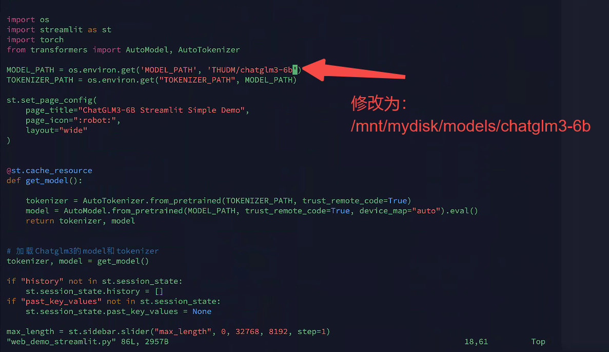
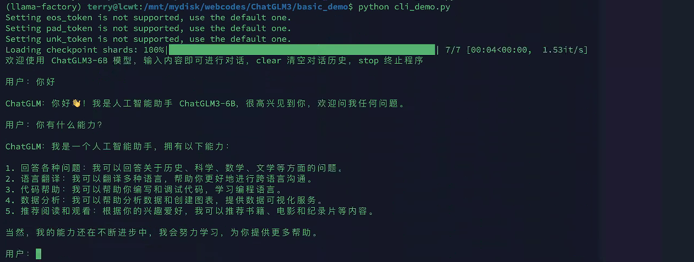
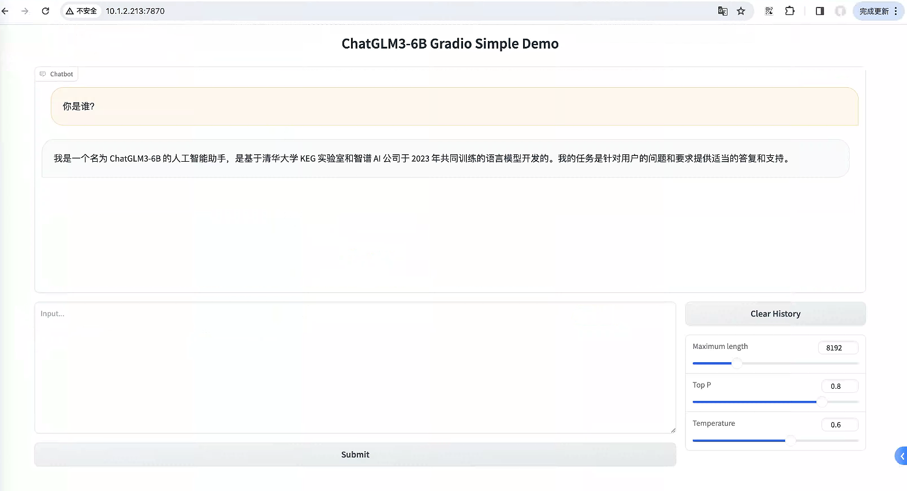
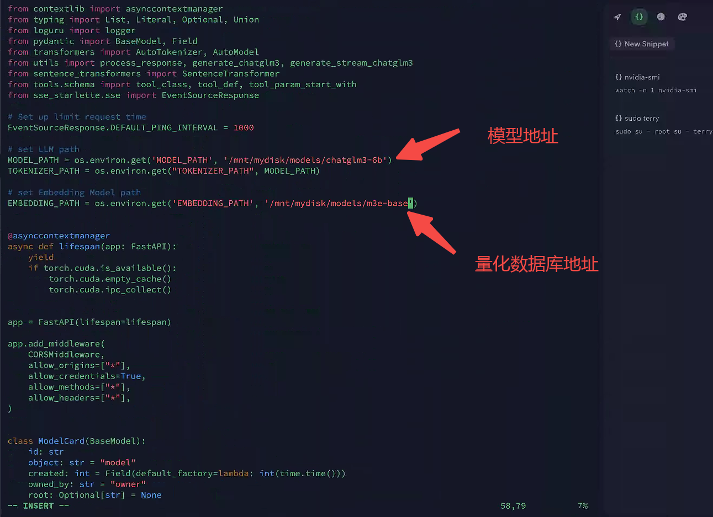
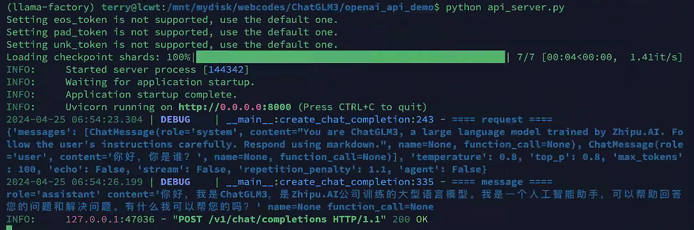
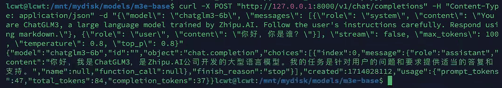

### 下载模型
```
mkdir /mnt/mydisk/models
cd /mnt/mydisk/models

apt update
apt install git-lfs # 用于下拉大文件
 
# 克隆chatGLM3-6b大模型
sudo git clone https://www.modelscope.cn/ZhipuAI/chatglm3-6b.git

```

### 下载项目
```
mkdir /mnt/mydisk/webcodes
cd /mnt/mydisk/webcodes
 
# 下载chatglm3-6b web_demo项目
sudo git clone https://github.com/THUDM/ChatGLM3.git

# 安装依赖
cd /mnt/mydisk/webcodes/ChatGLM3
pip install -r requirements.txt
```

### 启动
#### 修改模型地址

#### 终端方式
```
cd /mnt/mydisk/webcodes/ChatGLM3/basic_demo
python cli_demo.py
```

#### 浏览器方式
```
# 修改模型地址和侦听地址
cd /mnt/mydisk/webcodes/ChatGLM3/basic_demo
python web_demo_streamlit.py
```

### OPENAI部署
#### 下载向量数据库，以m3为例
```
cd /mnt/mydisk/models
sudo git clone https://www.modelscope.cn/xrunda/m3e-base.git
```
#### 修改模型地址和embedding地址


#### 启动
```
cd /mnt/mydisk/webcodes/ChatGLM3/openai_api_demo
python api_server.py
```

#### 测试
```
curl -X POST "http://127.0.0.1:8000/v1/chat/completions" \
-H "Content-Type: application/json" \
-d "{\"model\": \"chatglm3-6b\", \"messages\": [{\"role\": \"system\", \"content\": \"You are ChatGLM3, a large language model trained by Zhipu.AI. Follow the user's instructions carefully. Respond using markdown.\"}, {\"role\": \"user\", \"content\": \"你好，你是谁？\"}], \"stream\": false, \"max_tokens\": 100, \"temperature\": 0.8, \"top_p\": 0.8}"

```
