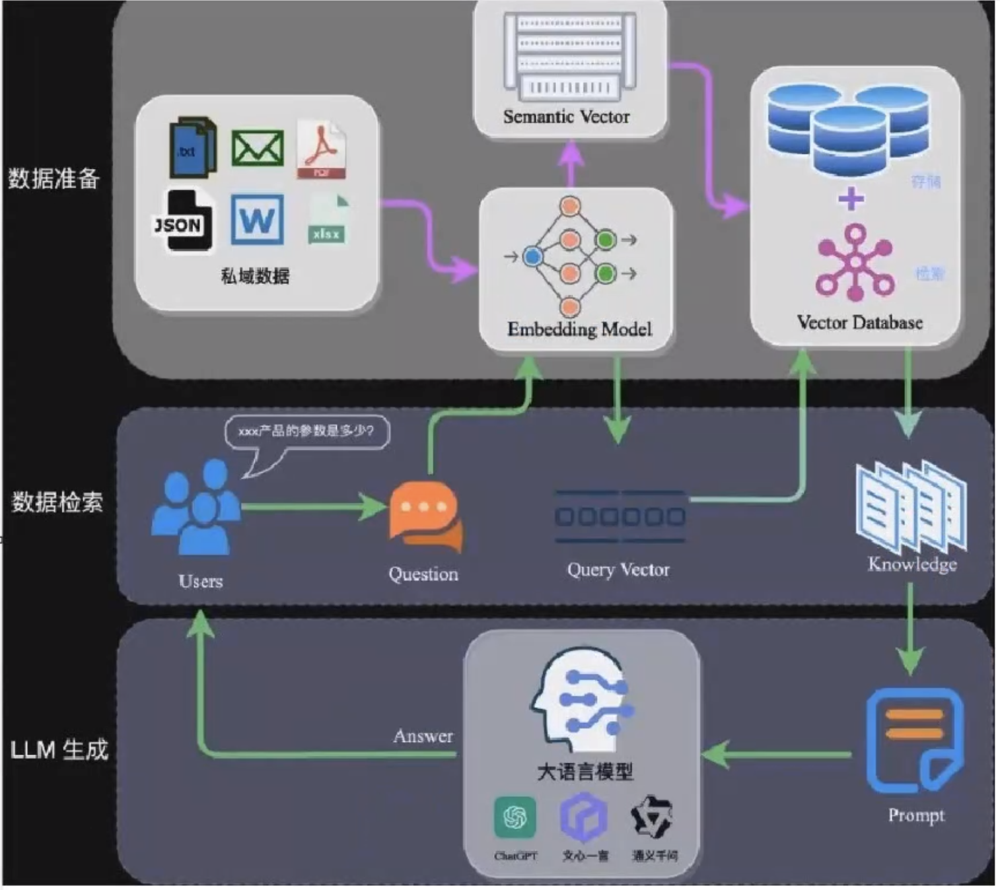

### RAG数据架构

### 为什么要用向量数据库存储数据而不是进行微调大模型
就一个字：贵
文档内容需要转换为token，然后对模型进行提问，大模型是按token收费的

### 为什么要做rag
#### 微调问题
- 能力不够
- 算力不够
- 实时问题（比如人员变动）

#### 原则问题
- 安全性问题
- 幻觉问题：数值错误，日期不敏感
- 局限性：大模型是通用的，需要专业领域模型